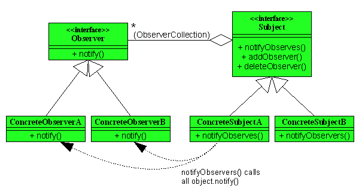

# Observer


## Subject
```php
<?php
namespace Observer;

class Cart
{
    private $items;

    private $listeners;

    public function __construct()
    {
        $this->items = [];
        $this->listeners = [];
    }

    public function addItem($item_cd)
    {
        $this->items[$item_cd] = (isset($this->items[$item_cd]) ? ++$this->items[$item_cd] : 1);
        $this->notify();
    }

    public function removeItem($item_cd)
    {
        $this->items[$item_cd] = (isset($this->items[$item_cd]) ? --$this->items[$item_cd] : 0);
        if ($this->items[$item_cd] <= 0) {
            unset($this->items[$item_cd]);
        }
        $this->notify();
    }

    public function getItems()
    {
        return $this->items;
    }

    public function hasItem($item_cd)
    {
        return array_key_exists($item_cd, $this->items);
    }

    public function addListener(CartListener $listener)
    {
        $this->listeners[get_class($listener)] = $listener;
    }

    public function removeListener(CartListener $listener)
    {
        unset($this->listeners[get_class($listener)]);
    }

    public function notify()
    {
        foreach ($this->listeners as $listener) {
            $listener->update($this);
        }
    }
}
```

## Observer
```php
<?php
namespace Observer;

interface CartListener
{
    public function update(Cart $cart);
}
```

## Concrete Observer
```php
<?php
namespace Observer;

class PresentListener implements CartListener
{
    private static $PRESENT_TARGET_ITEM = '30:クッキーセット';

    private static $PRESENT_ITEM = '99:プレゼント';

    public function __construct()
    {
        //
    }

    public function update(Cart $cart)
    {
        if ($cart->hasItem(self::$PRESENT_TARGET_ITEM) &&
            !$cart->hasItem(self::$PRESENT_ITEM)) {
                $cart->addItem(self::$PRESENT_ITEM);
        }

        if (!$cart->hasItem(self::$PRESENT_TARGET_ITEM) &&
            $cart->hasItem(self::$PRESENT_ITEM)) {
                $cart->removeItem(self::$PRESENT_ITEM);
        }
    }
}
```