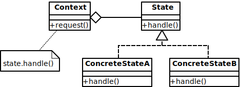

# State


## Context
```php
<?php
namespace State;

class User
{
    private $name;

    private $state;

    private $count = 0;

    public function __construct($name)
    {
        $this->name = $name;
        $this->state = UnauthorizedState::getInstance();
        $this->resetCount();
    }

    public function switchState()
    {
        echo "状態遷移：" . get_class($this->state) . "⇨";
        $this->state = $this->state->nextState();
        echo get_class($this->state) . "\n";
        $this->resetCount();
    }

    public function isAuthenticated()
    {
        return $this->state->isAuthenticated();
    }

    public function getMenu()
    {
        return $this->state->getMenu();
    }

    public function getUserName()
    {
        return $this->name;
    }

    public function getCount()
    {
        return $this->count;
    }

    public function incrementCount()
    {
        $this->count++;
    }

    public function resetCount()
    {
        $this->count = 0;
    }
}
```

## State
```php
<?php
namespace State;

interface UserState
{
    public function isAuthenticated();

    public function nextState();

    public function getMenu();
}
```

## Concrete State
```php
<?php
namespace State;

use RuntimeException;

class AuthorizedState implements UserState
{
    private static $singleton = null;

    private function __construct()
    {
        //
    }

    public static function getInstance()
    {
        if (self::$singleton == null) {
            self::$singleton = new AuthorizedState();
        }
        return self::$singleton;
    }

    public function isAuthenticated()
    {
        return true;
    }

    public function nextState()
    {
        return UnauthorizedState::getInstance();
    }

    public function getMenu()
    {
        //
    }

    public function __clone()
    {
        throw new RuntimeException('Clone is no allowed against ' . get_class($this));
    }
}
```