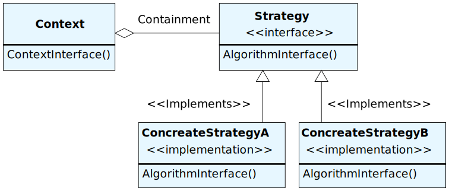

# Strategy


## Context
```php
<?php
namespace Strategy;

class ItemDataContext
{
    private $strategy;

    public function __construct(ReadItemDataStrategy $strategy)
    {
        $this->strategy = $strategy;
    }

    public function getItemData()
    {
        return $this->strategy->getData();
    }
}
```

## Strategy
```php
<?php
namespace Strategy;

use Exception;

abstract class ReadItemDataStrategy
{
    private $filename;

    public function __construct($filename)
    {
        $this->filename = $filename;
    }

    public function getData()
    {
        if (!is_readable($this->getFilename())) {
            throw new Exception('file [' . $this->getFilename() . '] is not readable.');
        }
        return $this->readData($this->getFilename());
    }

    public function getFilename()
    {
        return $this->filename;
    }

    protected abstract function readData($filename);
}
```

## Concrete Strategy
```php
<?php
namespace Strategy;

use stdClass;

class ReadTabSeparatedDataStrategy extends ReadItemDataStrategy
{
    protected function readData($filename)
    {
        $fp = fopen($filename, 'r');

        $dummy = fgets($fp, 4096);
        $return_value = [];
        while ($buffer = fgets($fp, 4096)) {
            list($item_code, $item_name, $price, $release_date) = explode("\t", $buffer);
            $obj = new stdClass;
            $obj->item_name = $item_name;
            $obj->item_code = $item_code;
            $obj->price = $price;

            list($year, $mon, $day) = (int)explode('/', $release_date);
            $obj->release_date = mktime(0,0,0,
                $mon, $day, $year);

            $return_value[] = $obj;
        }
        fclose($fp);
        return $return_value;
    }
}
```