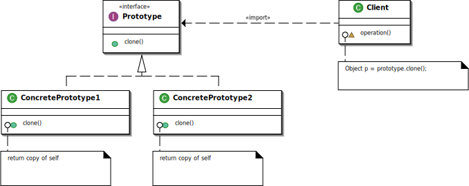

# Prototype



## Prototype
```php
<?php

namespace Prototype;

interface Product
{
    public function use($s);

    public function createClone();
}
```

## Concrete Prototype
```php
<?php

namespace Prototype;

class MessageBox implements Product
{
    private $decochar;

    public function __construct($decochar)
    {
        $this->decochar = $decochar;
    }

    public function use($s)
    {
        $length = strlen($s);
        for ($i = 0; $i < $length + 4; $i++) {
            echo $this->decochar;
        }
        echo "\n";
        echo $this->decochar . " " . $s . " " . $this->decochar . "\n";
        for ($i = 0; $i < $length + 4; $i++) {
            echo $this->decochar;
        }
        echo "\n";
    }

    public function createClone()
    {
        $p = null;
        $p = clone $this;
        return $p;
    }
}
```

```php
<?php

namespace Prototype;

class UnderlinePen implements Product
{
    private $ulchar;

    public function __construct($ulchar)
    {
        $this->ulchar = $ulchar;
    }

    public function use($s)
    {
        $length = strlen($s);
        echo "¥" . $s . "¥" . "\n";
        echo " ";
        for ($i = 0; $i < $length; $i++) {
            echo $this->ulchar;
        }
        echo "\n";
    }

    public function createClone()
    {
        $p = null;
        $p = clone $this;
        return $p;
    }
}
```

## Client
```php
<?php

namespace Prototype;

use Prototype\Product;

class Manager
{
    private $showcase;

    public function register($name, Product $proto)
    {
        $this->showcase[$name] = $proto;
    }

    public function create($protoname)
    {
        $p = $this->showcase[$protoname];
        return $p->createClone();
    }
}
```