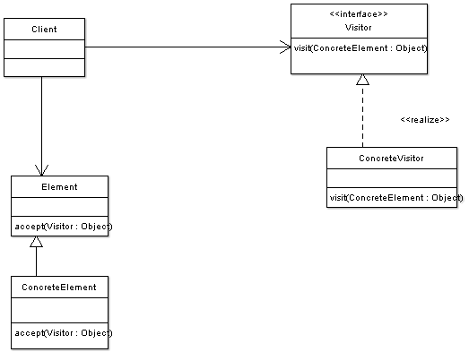

# Visitor



## Element

```php
<?php

namespace Visitor;

interface Element
{
    public function accept($v);
}
```

## ConcreteElement
```php
<?php

namespace Visitor;

abstract class Entry implements Element
{
    public abstract function getName();

    public abstract function getSize();

    public function iterator()
    {
        throw new Exception();
    }

    public function __toString()
    {
        return $this->getName() . "(" . $this->getSize() . ")";
    }
}
```

## Visitor
```php
<?php

namespace Visitor;

abstract class Visitor
{
    public abstract function visit($directory);
}
```

## ConcreteVisitor
```php
<?php

namespace Visitor;

class ListVisitor extends Visitor
{
    private $currentDir;
    
    public function visit($directory)
    {
        if ($directory instanceof File) {
            echo $this->currentDir . "/" . $directory . "\n";
            return;
        }

        echo $this->currentDir . "/" . $directory . "\n";
        $savedir = $this->currentDir;
        $this->currentDir = $this->currentDir . "/" . $directory->getName();
        foreach($directory as $entry) {
            $entry->accecpt($this);
        }
        $this->currentDir = $savedir;
    }
}
```